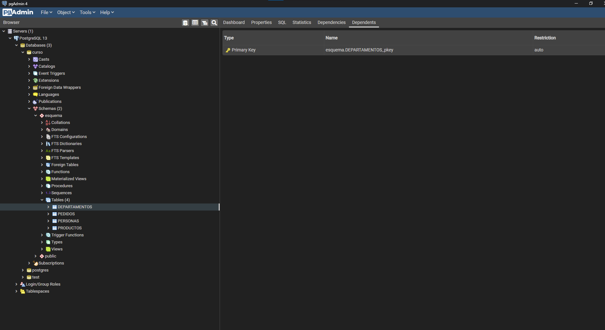

## Usando la Base de datos

_Cargar la Base de datos_

*Restaurar*

<table align="center">
  <tr>
    <td align="center" style="padding=0;width=50%;">
      
    </td>
  </tr>
</table>

*Base de dartos Cargada*

<table align="center">
  <tr>
    <td align="center" style="padding=0;width=50%;">
      
    </td>
  </tr>
</table>

