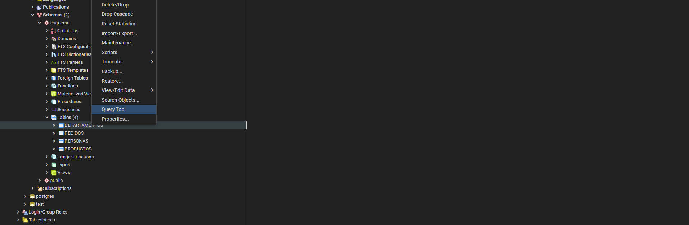
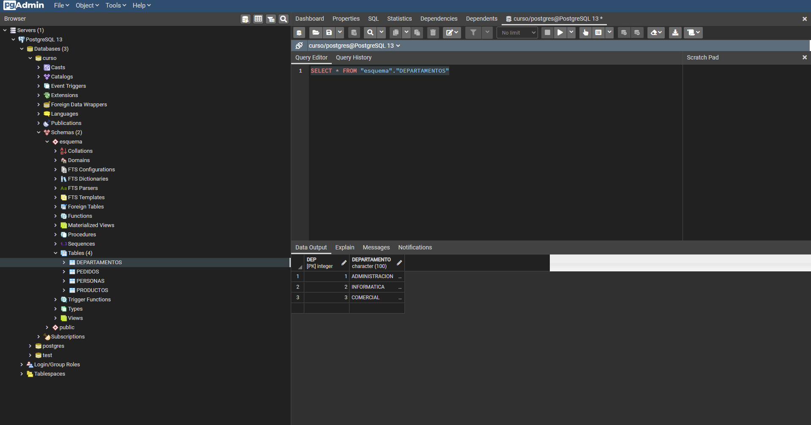

### Visualizar Tablas

_Usando Query Tools_

<table align="center">
  <tr>
    <td align="center" style="padding=0;width=50%;">
      
    </td>
  </tr>
</table>

_SELECT_

```sql
SELECT * FROM "esquema"."DEPARTAMENTOS"
```

<table align="center">
  <tr>
    <td align="center" style="padding=0;width=50%;">
      
    </td>
  </tr>
</table>

_QUERY HISTORY_

<table align="center">
  <tr>
    <td align="center" style="padding=0;width=50%;">
      
    </td>
  </tr>
</table>