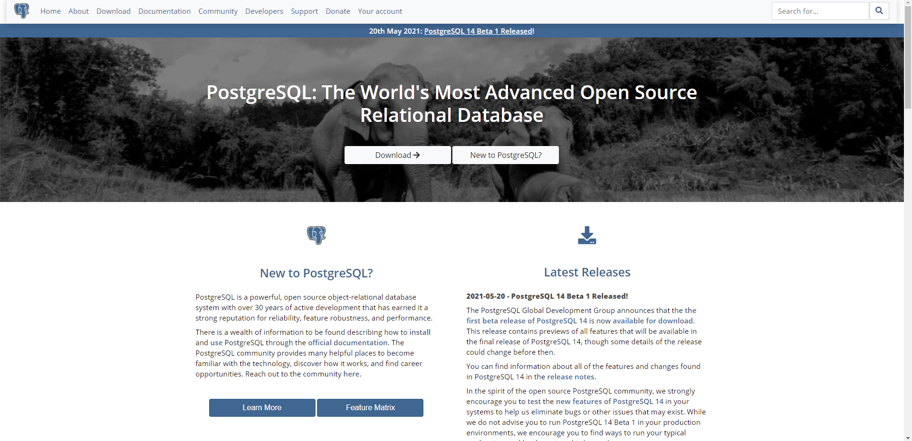
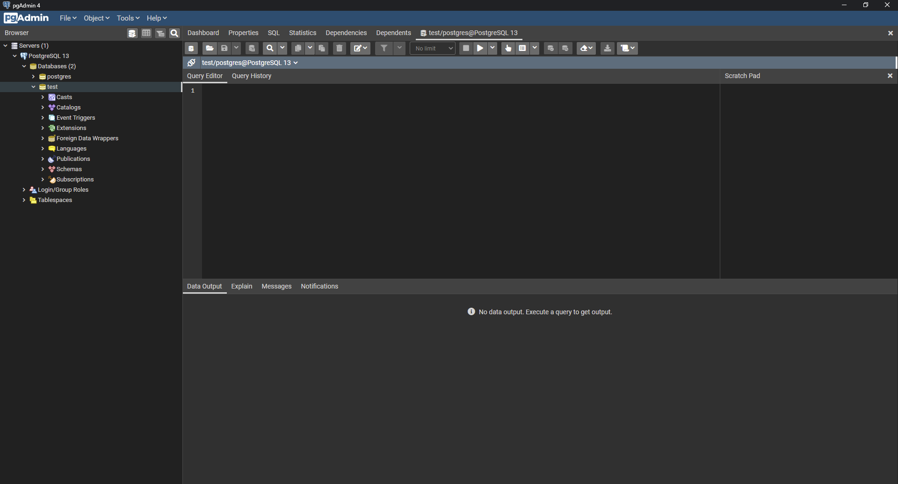
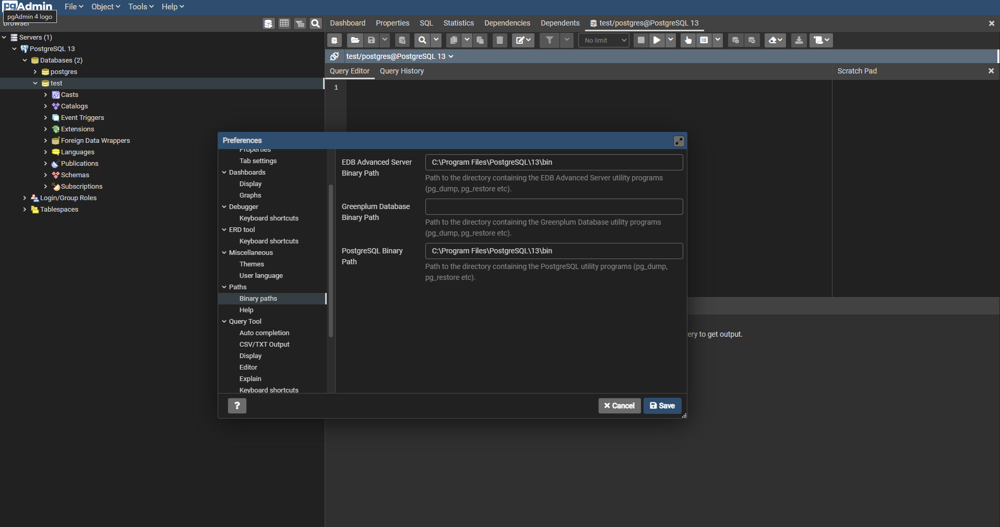
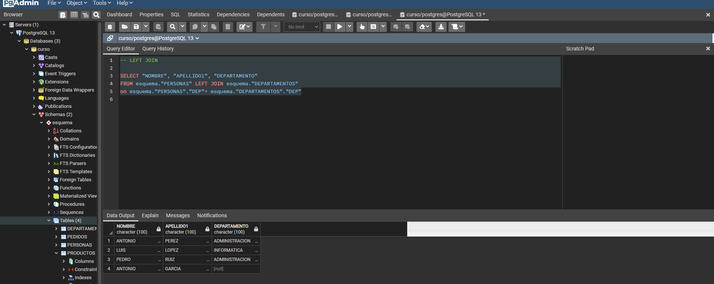
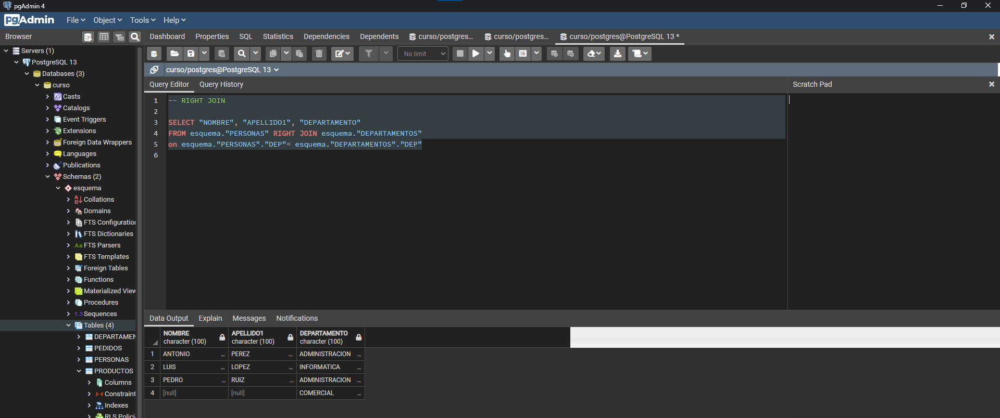
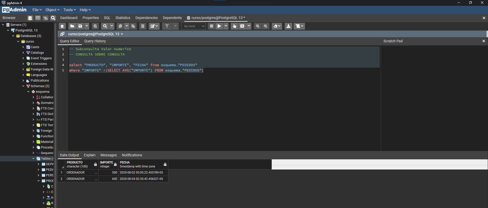
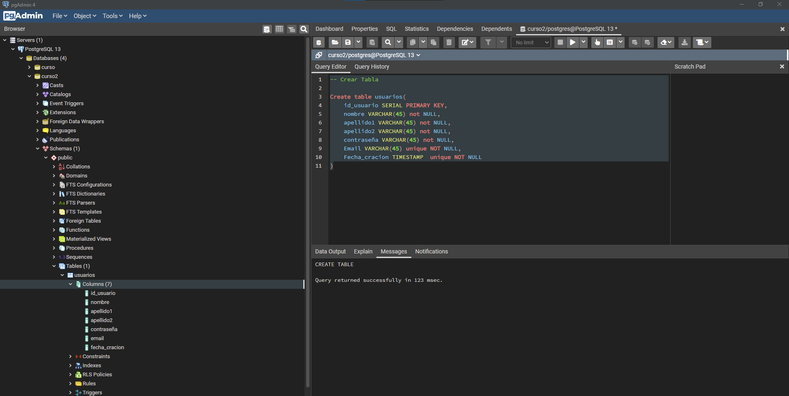
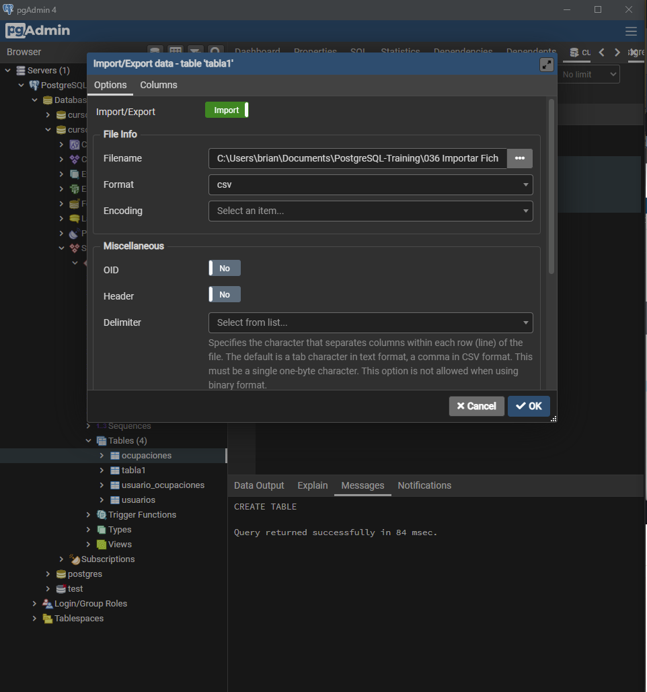
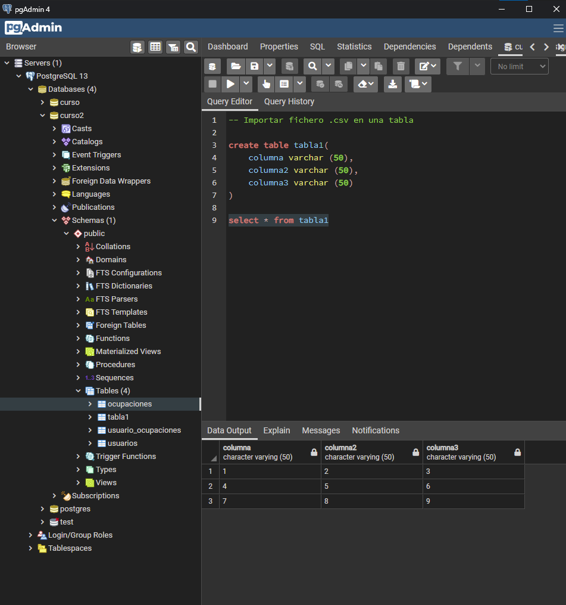
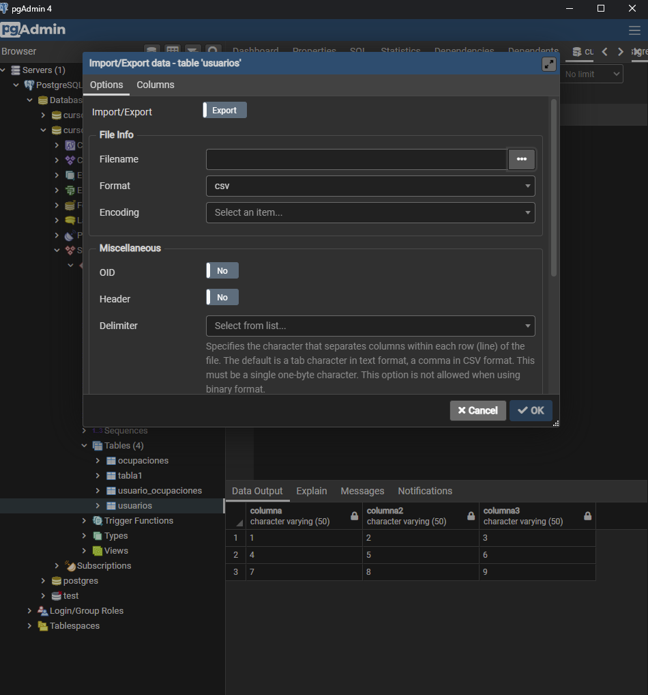

<h2 align="center"> 🐘 PostgreSQL Training </h2>

<p align="center">
  
  </a>
    
  </a>
  <a href="https://github.com/brian-emarquez/PostgreSQL-Training/stargazers">
    
  </a>
  <a href="https://github.com/brian-emarquez/PostgreSQL-Training/network">
    
  </a>
    
  </a>
  </a>
    
  </a>
  </a>
    
  </a>
  </a>
   <a href="https://github.com/brian-emarquez/PostgreSQL-Training/network">
    
    
  </a><br>
  
  
</P>

<table align="center">
  <tr>
    <td align="center" style="padding=0;width=50%;">
      
    </td>
  </tr>
</table>

[PostgreSQL Documentation](https://www.postgresql.org/docs/current/index.html)

## Table of Contents

| Numeration   | Check       | Stiker        |    Topic      |   Quantization   |    Edit Gitpot    |    Downloads    |  link  |
| ------------ |-------------|-------------- |----------------- |------------------ |---------------- |-------------- |------------- |
|  001   |:heavy_check_mark: | | [Downloads](#Downloads)   | ✔️    | 💻 | 💾 | [ ⬅️ back](https://github.com/brian-emarquez)| 
|  002   |:heavy_check_mark: | | [Usando la DB](#Usando-la-DB)   | ✔️    | 💻 | 💾 | [ ⬅️ back](https://github.com/brian-emarquez)| 
|  003   |:heavy_check_mark: | | [Visualizar Informacion Tablas](#Visualizar-Informacion-Tablas)   | ✔️    | 💻 | 💾 | [ ⬅️ back](https://github.com/brian-emarquez)| 
|  004   |:heavy_check_mark: | | [SELECT](#SELECT)   | ✔️    | 💻 | 💾 | [ ⬅️ back](https://github.com/brian-emarquez)| 
|  005   |:heavy_check_mark: | | [SELECT DISTINCT](#SELECT-DISTINCT)   | ✔️    | 💻 | 💾 | [ ⬅️ back](https://github.com/brian-emarquez)| 
|  006   |:heavy_check_mark: | | [SELECT COUNT](#SELECT-COUNT)   | ✔️    | 💻 | 💾 | [ ⬅️ back](https://github.com/brian-emarquez)| 
|  007   |:heavy_check_mark: | | [WHERE](#WHERE)   | ✔️    | 💻 | 💾 | [ ⬅️ back](https://github.com/brian-emarquez)| 
|  008   |:heavy_check_mark: | | [ORDER BY](#ORDER-BY)   | ✔️    | 💻 | 💾 | [ ⬅️ back](https://github.com/brian-emarquez)| 
|  009   |:heavy_check_mark: | | [LIMIT](#LIMIT)   | ✔️    | 💻 | 💾 | [ ⬅️ back](https://github.com/brian-emarquez)| 
|  010   |:heavy_check_mark: | | [BETWEEN](#BETWEEN)   | ✔️    | 💻 | 💾 | [ ⬅️ back](https://github.com/brian-emarquez)| 
|  011   |:heavy_check_mark: | | [IN](#IN)   | ✔️    | 💻 | 💾 | [ ⬅️ back](https://github.com/brian-emarquez)| 
|  012   |:heavy_check_mark: | | [LIKE](#LIKE)   | ✔️    | 💻 | 💾 | [ ⬅️ back](https://github.com/brian-emarquez)| 
|  013   |:heavy_check_mark: | | [HAVING](#HAVING)   | ✔️    | 💻 | 💾 | [ ⬅️ back](https://github.com/brian-emarquez)| 
|  014   |:heavy_check_mark: | | [GROUP BY](#GROUP-BY)   | ✔️    | 💻 | 💾 | [ ⬅️ back](https://github.com/brian-emarquez)| 
|  015   |:heavy_check_mark: | | [AS](#AS)   | ✔️    | 💻 | 💾 | [ ⬅️ back](https://github.com/brian-emarquez)| 


## Union de Tablas

| Numeration   | Check       | Stiker        |    Topic      |   Quantization   |    Edit Gitpot    |    Downloads    |  link  |
| ------------ |-------------|-------------- |----------------- |------------------ |---------------- |-------------- |------------- |
|  016   |:heavy_check_mark: | | [AS](#AS)   | ✔️    | 💻 | 💾 | [ ⬅️ back](https://github.com/brian-emarquez)| 
|  017   |:heavy_check_mark: | | [INNER JOIN](#INNER-JOIN)   | ✔️    | 💻 | 💾 | [ ⬅️ back](https://github.com/brian-emarquez)| 
|  018   |:heavy_check_mark: | | [FULL JOIN](#FULL-JOIN)   | ✔️    | 💻 | 💾 | [ ⬅️ back](https://github.com/brian-emarquez)| 
|  019   |:heavy_check_mark: | | [LEFT JOIN](#LEFT-JOIN)   | ✔️    | 💻 | 💾 | [ ⬅️ back](https://github.com/brian-emarquez)| 
|  020   |:heavy_check_mark: | | [RIGHT JOIN](#RIGHT-JOIN)   | ✔️    | 💻 | 💾 | [ ⬅️ back](https://github.com/brian-emarquez)| 
|  021   |:heavy_check_mark: | | [UNION](#UNION)   | ✔️    | 💻 | 💾 | [ ⬅️ back](https://github.com/brian-emarquez)| 

## Funciones 

| Numeration   | Check       | Stiker        |    Topic      |   Quantization   |    Edit Gitpot    |    Downloads    |  link  |
| ------------ |-------------|-------------- |----------------- |------------------ |---------------- |-------------- |------------- |
|  022   |:heavy_check_mark: | | [Formato Hora Fecha](#Formato-Hora-Fecha)   | ✔️    | 💻 | 💾 | [ ⬅️ back](https://github.com/brian-emarquez)| 
|  023   |:heavy_check_mark: | | [Funciones Matematicas](#Funciones-Matematicas)   | ✔️    | 💻 | 💾 | [ ⬅️ back](https://github.com/brian-emarquez)| 
|  024   |:heavy_check_mark: | | [Funciones Caracteres](#Funciones-Caracteres)   | ✔️    | 💻 | 💾 | [ ⬅️ back](https://github.com/brian-emarquez)| 
|  025   |:heavy_check_mark: | | [Subconsulta Valor numerico](#Subconsulta-Valor-numerico)   | ✔️    | 💻 | 💾 | [ ⬅️ back](https://github.com/brian-emarquez)| 
|  026   |:heavy_check_mark: | | [Subconsulta por lista de Valores](#Subconsulta-por-lista-de-Valores)   | ✔️    | 💻 | 💾 | [ ⬅️ back](https://github.com/brian-emarquez)| 
|  027   |:heavy_check_mark: | | [Subconsulta con EXITS](#Subconsulta-con-EXITS)   | ✔️    | 💻 | 💾 | [ ⬅️ back](https://github.com/brian-emarquez)| 

## Base de Datos

| Numeration   | Check       | Stiker        |    Topic      |   Quantization   |    Edit Gitpot    |    Downloads    |  link  |
| ------------ |-------------|-------------- |----------------- |------------------ |---------------- |-------------- |------------- |
|  028   |:heavy_check_mark: | | [Bases de Datos](#Bases-de-Datos)   | ✔️    | 💻 | 💾 | [ ⬅️ back](https://github.com/brian-emarquez)| 
|  029   |:heavy_check_mark: | | [Crear Tabla SQL](#Crear-Tabla-SQL)   | ✔️    | 💻 | 💾 | [ ⬅️ back](https://github.com/brian-emarquez)| 
|  030   |:heavy_check_mark: | | [Insert SQL](#Insert-SQL)   | ✔️    | 💻 | 💾 | [ ⬅️ back](https://github.com/brian-emarquez)| 
|  031   |:heavy_check_mark: | | [UPDATE](#UPDATE )  | ✔️    | 💻 | 💾 | [ ⬅️ back](https://github.com/brian-emarquez)| 
|  032   |:heavy_check_mark: | | [DELETE](#DELETE )  | ✔️    | 💻 | 💾 | [ ⬅️ back](https://github.com/brian-emarquez)| 
|  033   |:heavy_check_mark: | | [ALTER](#ALTER )  | ✔️    | 💻 | 💾 | [ ⬅️ back](https://github.com/brian-emarquez)| 
|  034   |:heavy_check_mark: | | [CASE](#CASE )  | ✔️    | 💻 | 💾 | [ ⬅️ back](https://github.com/brian-emarquez)| 
|  035   |:heavy_check_mark: | | [COALESCE](#COALESCE)  | ✔️    | 💻 | 💾 | [ ⬅️ back](https://github.com/brian-emarquez)| 
|  036   |:heavy_check_mark: | | [CAST](#CAST)  | ✔️    | 💻 | 💾 | [ ⬅️ back](https://github.com/brian-emarquez)| 
|  037   |:heavy_check_mark: | | [Importar Ficheros](#Importar-Ficheros)  | ✔️    | 💻 | 💾 | [ ⬅️ back](https://github.com/brian-emarquez)| 
|  038   |:heavy_check_mark: | | [Exportar Ficheros](#Exportar-Ficheros)  | ✔️    | 💻 | 💾 | [ ⬅️ back](https://github.com/brian-emarquez)| 

---

## Downloads

⚙️ [Install PostgreSQL Linux ](https://www.digitalocean.com/community/tutorials/how-to-install-and-use-postgresql-on-ubuntu-20-04-es) How to install and use PostgreSQL on Ubuntu<br>
⚙️ [Install PostgreSQL Windows](https://www.postgresql.org/download/windows/) Download the installer for windows <br>

<table align="center">
  <tr>
    <td align="center" style="padding=0;width=50%;">
      
    </td>
  </tr>
</table>

<table align="center">
  <tr>
    <td align="center" style="padding=0;width=50%;">
      
    </td>
  </tr>
</table>

**Correccion del Error PATH** <br>

_Cambiar la Direccion del PATH de PostgreSQL_

<table align="center">
  <tr>
    <td align="center" style="padding=0;width=50%;">
      
    </td>
  </tr>
</table>

_Iniciar Postgres - Ubuntu_

```sql
sudo service postgresql start
sudo service postgresql status
```

## Linux installation - Ubuntu (Intallation/Comandos)

* [Comandos consola Postgres](https://apuntes-snicoper.readthedocs.io/es/latest/programacion/postgresql/comandos_consola_psql.html) 

**Install Postgres**

* [Install Postgres Actual en Ubuntu](https://www.digitalocean.com/community/tutorials/how-to-install-and-use-postgresql-on-ubuntu-20-04-es)

* [Install Postgres 14 en Ubuntu](https://techviewleo.com/how-to-install-postgresql-database-on-ubuntu/)

* [Install Docker](https://www.digitalocean.com/community/tutorials/how-to-install-and-use-docker-on-ubuntu-20-04-es)

* [Install Doker Compose](https://www.digitalocean.com/community/tutorials/how-to-install-and-use-docker-compose-on-ubuntu-20-04)

**Delete Postgres**

* [Uninstall ubuntu Terminal Postgres Simple](https://www.enmimaquinafunciona.com/pregunta/30210/como-quitar-a-postgres-de-mi-instalacion)
* [Eliminar Postgres Completamente](https://www.enmimaquinafunciona.com/pregunta/30210/como-quitar-a-postgres-de-mi-instalacion)

**Restore Database**

```sql
pg_restore -h 127.0.0.1 -p 5432 -U user -d database < backup.sql
psql -h 127.0.0.1 -p 5432 -U user -W -d dabatase < backup.sql
```

**Backup Base de Datos**

```sql
pg_dump -U postgres -W -h 127.0.0.1 database > backup.sql
```

**Create Postgres Password**

```bash
sudo -u postgres psql
\password
Enter password: ...
```

**Inicializar Postgres - Ubuntu terminal**

```bash
 service postgresql start
 ```
 ```bash
 service postgresql status
 ```
 ```bash
 service postgresql stop
 ```

 **Usar Postgres**

_Cambie a la cuenta de postgres_
 ```bash
sudo -i -u postgres
 ```

_Acceder de inmediato a una línea de comandos de PostgresSQL_
```bash
psql
```

_ver base de datos_
_Acceder de inmediato a una línea de comandos de PostgresSQL_
```bash
\l
```

_entrar a la base de datos_
_Acceder de inmediato a una línea de comandos de PostgresSQL_
```bash
\dt nasededatos
```

**Create Postgres User**

* [DigitalOcean](https://www.digitalocean.com/community/tutorials/como-configurar-django-con-postgres-nginx-y-gunicorn-en-ubuntu-18-04-es)

* [Como crear usuarios en PostgreSQL](https://www.todopostgresql.com/crear-usuarios-en-postgresql/)


```sql
CREATE USER newuser WITH PASSWORD 'password';
GRANT ALL PRIVILEGES ON DATABASE database to newuser;
```

**Ver Usuarios**

```sql
SELECT usename FROM pg_user;
```

**Rename a database**

```sql
ALTER DATABASE olddbname RENAME TO newdbname;
```

**Delete user postgres**

* [Como crear usuarios en PostgreSQL](https://codeandoando.com/usuarios-y-permisos-en-postgresql/)

**Configuration Information**

<P> La utilidad postgresql pg_lsclusters muestra información sobre la configuración y el estado de todos los clusters, incluyendo el número de puerto. </P>

```sql
$ pg_lsclusters
```

**Migrating from SQLite to Postgresql - Django**

Migrating data from SQlite to PostgreSQL. Shift database from SQlite to PostgreSQL in Django
[Migrating data from SQlite to PostgreSQL | Django](https://www.youtube.com/watch?v=BGEEzjGadYI&ab_channel=StudyGyaan)

_Data.json_

```sql
python manage.py dumpdata > data.json
```

_Example Setting Django_

```sql
DATABASES = {
    'default': {
        'ENGINE': 'django.db.backends.postgresql_psycopg2',
        'NAME': 'p2phelp_db',
        'USER': 'briandb',
        'PASSWORD': 'briandb',
        'HOST': 'localhost',
        'PORT': '5432'
    }
}
```

_Python Django Shell_

```sql
python manage.py migrate --run-syncdb
```

```sql
python manage.py shell
```

```sql
from django.contrib.contenttypes.models import ContentType
ContentType.objects.all().delete()
exit()
```

```sql
python manage.py loaddata data.json
```

---

## Usando la DB

|Numeration  | File   |  Link       |    Folk     |  Code       | Version     | State       | Download    |  Go back    |
|:----------:|:------:|:-----------:|:-----------:|:-----------:|:-----------:|:-----------:|:-----------:|:-----------:|
|002         | [Usando la DB](https://github.com/brian-emarquez/PostgreSQL-Training/tree/main/002%20Usando%20la%20BD)  | ✔️  | ✔️ | yes | yes | ✔️ | 💾 | [⬅️Atras](#Table-of-Contents) |

## Visualizar Informacion Tablas

|Numeration  | File   |  Link       |    Folk     |  Code       | Version     | State       | Download    |  Go back    |
|:----------:|:------:|:-----------:|:-----------:|:-----------:|:-----------:|:-----------:|:-----------:|:-----------:|
|003         | [Visualizar Informacion Tablas](https://github.com/brian-emarquez/PostgreSQL-Training/tree/main/003%20Visualizar%20Informacion%20Tablas)  | ✔️  | ✔️ | yes | yes | ✔️ | 💾 | [⬅️Atras](#Table-of-Contents) |

## SELECT

|Numeration  | File   |  Link       |    Folk     |  Code       | Version     | State       | Download    |  Go back    |
|:----------:|:------:|:-----------:|:-----------:|:-----------:|:-----------:|:-----------:|:-----------:|:-----------:|
|004         | [SELECT](https://github.com/brian-emarquez/PostgreSQL-Training/tree/main/004%20SELECT)  | ✔️  | ✔️ | yes | yes | ✔️ | 💾 | [⬅️Atras](#Table-of-Contents) |


## SELECT DISTINCT

|Numeration  | File   |  Link       |    Folk     |  Code       | Version     | State       | Download    |  Go back    |
|:----------:|:------:|:-----------:|:-----------:|:-----------:|:-----------:|:-----------:|:-----------:|:-----------:|
|005         | [SELECT DISTINCT](https://github.com/brian-emarquez/PostgreSQL-Training/tree/main/005%20SELECT%20DISTINCT)  | ✔️  | ✔️ | yes | yes | ✔️ | 💾 | [⬅️Atras](#Table-of-Contents) |


## SELECT COUNT

|Numeration  | File   |  Link       |    Folk     |  Code       | Version     | State       | Download    |  Go back    |
|:----------:|:------:|:-----------:|:-----------:|:-----------:|:-----------:|:-----------:|:-----------:|:-----------:|
|006         | [SELECT COUNT](https://github.com/brian-emarquez/PostgreSQL-Training/tree/main/006%20SELECT%20COUNT)  | ✔️  | ✔️ | yes | yes | ✔️ | 💾 | [⬅️Atras](#Table-of-Contents) |


## WHERE

|Numeration  | File   |  Link       |    Folk     |  Code       | Version     | State       | Download    |  Go back    |
|:----------:|:------:|:-----------:|:-----------:|:-----------:|:-----------:|:-----------:|:-----------:|:-----------:|
|007         | [WHERE](https://github.com/brian-emarquez/PostgreSQL-Training/tree/main/007%20WHERE)  | ✔️  | ✔️ | yes | yes | ✔️ | 💾 | [⬅️Atras](#Table-of-Contents) |

## ORDER BY

|Numeration  | File   |  Link       |    Folk     |  Code       | Version     | State       | Download    |  Go back    |
|:----------:|:------:|:-----------:|:-----------:|:-----------:|:-----------:|:-----------:|:-----------:|:-----------:|
|008         | [ORDER BY](https://github.com/brian-emarquez/PostgreSQL-Training/tree/main/008%20ORDER%20BY)  | ✔️  | ✔️ | yes | yes | ✔️ | 💾 | [⬅️Atras](#Table-of-Contents) |


## LIMIT

|Numeration  | File   |  Link       |    Folk     |  Code       | Version     | State       | Download    |  Go back    |
|:----------:|:------:|:-----------:|:-----------:|:-----------:|:-----------:|:-----------:|:-----------:|:-----------:|
|009         | [LIMIT](https://github.com/brian-emarquez/PostgreSQL-Training/tree/main/009%20LIMIT)  | ✔️  | ✔️ | yes | yes | ✔️ | 💾 | [⬅️Atras](#Table-of-Contents) |

## BETWEEN

|Numeration  | File   |  Link       |    Folk     |  Code       | Version     | State       | Download    |  Go back    |
|:----------:|:------:|:-----------:|:-----------:|:-----------:|:-----------:|:-----------:|:-----------:|:-----------:|
|010         | [BETWEEN](https://github.com/brian-emarquez/PostgreSQL-Training/tree/main/010%20BETWEEN)  | ✔️  | ✔️ | yes | yes | ✔️ | 💾 | [⬅️Atras](#Table-of-Contents) |

## IN
|Numeration  | File   |  Link       |    Folk     |  Code       | Version     | State       | Download    |  Go back    |
|:----------:|:------:|:-----------:|:-----------:|:-----------:|:-----------:|:-----------:|:-----------:|:-----------:|
|011        | [IN](https://github.com/brian-emarquez/PostgreSQL-Training/tree/main/011%20IN)  | ✔️  | ✔️ | yes | yes | ✔️ | 💾 | [⬅️Atras](#Table-of-Contents) |

## LIKE
|Numeration  | File   |  Link       |    Folk     |  Code       | Version     | State       | Download    |  Go back    |
|:----------:|:------:|:-----------:|:-----------:|:-----------:|:-----------:|:-----------:|:-----------:|:-----------:|
|012        | [LIKE](https://github.com/brian-emarquez/PostgreSQL-Training/tree/main/012%20LIKE)  | ✔️  | ✔️ | yes | yes | ✔️ | 💾 | [⬅️Atras](#Table-of-Contents) |

## GROUP-BY

```sql
SELECT "PRODUCTO", SUM("IMPORTE")
FROM esquema."PEDIDOS"
GROUP BY "PRODUCTO"
```

|Numeration  | File   |  Link       |    Folk     |  Code       | Version     | State       | Download    |  Go back    |
|:----------:|:------:|:-----------:|:-----------:|:-----------:|:-----------:|:-----------:|:-----------:|:-----------:|
|013        | [GROUP-BY](https://github.com/brian-emarquez/PostgreSQL-Training/tree/main/013%20GROUP%20BY)  | ✔️  | ✔️ | yes | yes | ✔️ | 💾 | [⬅️Atras](#Table-of-Contents) |


## HAVING

|Numeration  | File   |  Link       |    Folk     |  Code       | Version     | State       | Download    |  Go back    |
|:----------:|:------:|:-----------:|:-----------:|:-----------:|:-----------:|:-----------:|:-----------:|:-----------:|
|014        | [HAVING](https://github.com/brian-emarquez/PostgreSQL-Training/tree/main/014%20HAVING)  | ✔️  | ✔️ | yes | yes | ✔️ | 💾 | [⬅️Atras](#Table-of-Contents) |

## Union de Tablas

## AS

```SQL
SELECT "ID" AS "CLAVE", "PRODUCTO" AS "VALOR 0", "IMPORTE"  AS "VALOR 1" 
from esquema."PEDIDOS"
```

|Numeration  | File   |  Link       |    Folk     |  Code       | Version     | State       | Download    |  Go back    |
|:----------:|:------:|:-----------:|:-----------:|:-----------:|:-----------:|:-----------:|:-----------:|:-----------:|
|015        | [AS](https://github.com/brian-emarquez/PostgreSQL-Training/tree/main/015%20AS)  | ✔️  | ✔️ | yes | yes | ✔️ | 💾 | [⬅️Atras](#Table-of-Contents) |


## INNER JOIN

|Numeration  | File   |  Link       |    Folk     |  Code       | Version     | State       | Download    |  Go back    |
|:----------:|:------:|:-----------:|:-----------:|:-----------:|:-----------:|:-----------:|:-----------:|:-----------:|
|016        | [INNER JOIN](https://github.com/brian-emarquez/PostgreSQL-Training/tree/main/015%20AS)  | ✔️  | ✔️ | yes | yes | ✔️ | 💾 | [⬅️Atras](#Table-of-Contents) |

## FULL JOIN

|Numeration  | File   |  Link       |    Folk     |  Code       | Version     | State       | Download    |  Go back    |
|:----------:|:------:|:-----------:|:-----------:|:-----------:|:-----------:|:-----------:|:-----------:|:-----------:|
|017        | [FULL JOIN](https://github.com/brian-emarquez/PostgreSQL-Training/tree/main/017%20FULL%20JOIN)  | ✔️  | ✔️ | yes | yes | ✔️ | 💾 | [⬅️Atras](#Table-of-Contents) |

## LEFT JOIN

<table align="center">
  <tr>
    <td align="center" style="padding=0;width=50%;">
      
    </td>
  </tr>
</table>

|Numeration  | File   |  Link       |    Folk     |  Code       | Version     | State       | Download    |  Go back    |
|:----------:|:------:|:-----------:|:-----------:|:-----------:|:-----------:|:-----------:|:-----------:|:-----------:|
|018        | [LEFT JOIN](https://github.com/brian-emarquez/PostgreSQL-Training/tree/main/018%20LEFT%20JOIN)  | ✔️  | ✔️ | yes | yes | ✔️ | 💾 | [⬅️Atras](#Table-of-Contents) |

## RIGHT JOIN

<table align="center">
  <tr>
    <td align="center" style="padding=0;width=50%;">
      
    </td>
  </tr>
</table>

|Numeration  | File   |  Link       |    Folk     |  Code       | Version     | State       | Download    |  Go back    |
|:----------:|:------:|:-----------:|:-----------:|:-----------:|:-----------:|:-----------:|:-----------:|:-----------:|
|019        | [RIGHT JOIN](https://github.com/brian-emarquez/PostgreSQL-Training/tree/main/019%20RIGHT%20LEFT)  | ✔️  | ✔️ | yes | yes | ✔️ | 💾 | [⬅️Atras](#Table-of-Contents) |

## UNION

<table align="center">
  <tr>
    <td align="center" style="padding=0;width=50%;">
      
    </td>
  </tr>
</table>

|Numeration  | File   |  Link       |    Folk     |  Code       | Version     | State       | Download    |  Go back    |
|:----------:|:------:|:-----------:|:-----------:|:-----------:|:-----------:|:-----------:|:-----------:|:-----------:|
|020        | [UNION](https://github.com/brian-emarquez/PostgreSQL-Training/tree/main/020%20UNION)  | ✔️  | ✔️ | yes | yes | ✔️ | 💾 | [⬅️Atras](#Table-of-Contents) |

## Funciones 

## Formato Hora Fecha

```SQL
SELECT EXTRACT (DAY FROM "FECHA") AS "DIAA"
FROM esquema."PEDIDOS" -- EXTRAE EL DIA
```

|Numeration  | File   |  Link       |    Folk     |  Code       | Version     | State       | Download    |  Go back    |
|:----------:|:------:|:-----------:|:-----------:|:-----------:|:-----------:|:-----------:|:-----------:|:-----------:|
|021         | [Formato Hora Fecha](https://github.com/brian-emarquez/PostgreSQL-Training/tree/main/021%20Formato%20Hora%20Fecha)  | ✔️  | ✔️ | yes | yes | ✔️ | 💾 | [⬅️Atras](#Funciones) |


## Funciones Matematicas

|Numeration  | File   |  Link       |    Folk     |  Code       | Version     | State       | Download    |  Go back    |
|:----------:|:------:|:-----------:|:-----------:|:-----------:|:-----------:|:-----------:|:-----------:|:-----------:|
|022         | [Funciones Matematicas](https://github.com/brian-emarquez/PostgreSQL-Training/tree/main/022%20Funcion%20matematicas)  | ✔️  | ✔️ | yes | yes | ✔️ | 💾 | [⬅️Atras](#Funciones) |


## Funciones Caracteres

|Numeration  | File   |  Link       |    Folk     |  Code       | Version     | State       | Download    |  Go back    |
|:----------:|:------:|:-----------:|:-----------:|:-----------:|:-----------:|:-----------:|:-----------:|:-----------:|
|023         | [Funciones Caracteres](https://github.com/brian-emarquez/PostgreSQL-Training/tree/main/023%20Funciones%20Caracteres)  | ✔️  | ✔️ | yes | yes | ✔️ | 💾 | [⬅️Atras](#Funciones) |

##  Subconsulta Valor numerico

<table align="center">
  <tr>
    <td align="center" style="padding=0;width=50%;">
      
    </td>
  </tr>
</table>

|Numeration  | File   |  Link       |    Folk     |  Code       | Version     | State       | Download    |  Go back    |
|:----------:|:------:|:-----------:|:-----------:|:-----------:|:-----------:|:-----------:|:-----------:|:-----------:|
|024         | [Subconsulta Valor numerico](https://github.com/brian-emarquez/PostgreSQL-Training/tree/main/024%20Subconsulta%20Valor%20numerico)  | ✔️  | ✔️ | yes | yes | ✔️ | 💾 | [⬅️Atras](#Funciones) |


## Subconsulta por lista de Valores

|Numeration  | File   |  Link       |    Folk     |  Code       | Version     | State       | Download    |  Go back    |
|:----------:|:------:|:-----------:|:-----------:|:-----------:|:-----------:|:-----------:|:-----------:|:-----------:|
|025         | [Subconsulta por lista de Valores](https://github.com/brian-emarquez/PostgreSQL-Training/tree/main/025%20Sunconsulta%20por%20lista%20de%20Valores)  | ✔️  | ✔️ | yes | yes | ✔️ | 💾 | [⬅️Atras](#Funciones) |


## Subconsulta con EXITS


```SQL
-- Subconsulta con EXITS

SELECT "NOMBRE", "APELLIDO1", "DEP"
from esquema."PERSONAS" as p
where EXISTS
(SELECT * FROM esquema."DEPARTAMENTOS" as D
WHERE D."DEP" = P."DEP")
```

|Numeration  | File   |  Link       |    Folk     |  Code       | Version     | State       | Download    |  Go back    |
|:----------:|:------:|:-----------:|:-----------:|:-----------:|:-----------:|:-----------:|:-----------:|:-----------:|
|026         | [Subconsulta con EXITS](https://github.com/brian-emarquez/PostgreSQL-Training/tree/main/026%20Subconsulta%20con%20EXITS)  | ✔️  | ✔️ | yes | yes | ✔️ | 💾 | [⬅️Atras](#Funciones) |


## Bases de Datos

**PostgreSQL CHECK constraint for new tables**

```sql
DROP TABLE IF EXISTS employees;
CREATE TABLE employees (
	id SERIAL PRIMARY KEY,
	first_name VARCHAR (50),
	last_name VARCHAR (50),
	birth_date DATE CHECK (birth_date > '1900-01-01'),
	joined_date DATE CHECK (joined_date > birth_date),
	salary numeric CHECK(salary > 0)
);
```

|Numeration  | File   |  Link       |    Folk     |  Code       | Version     | State       | Download    |  Go back    |
|:----------:|:------:|:-----------:|:-----------:|:-----------:|:-----------:|:-----------:|:-----------:|:-----------:|
|027         | [Base de Datos](https://github.com/brian-emarquez/PostgreSQL-Training/tree/main/027%20Base%20de%20datos)  | ✔️  | ✔️ | yes | yes | ✔️ | 💾 | [⬅️Atras](#Funciones) |


## Crear Tabla SQL

<table align="center">
  <tr>
    <td align="center" style="padding=0;width=50%;">
      
    </td>
  </tr>
</table>


_Tabla Usuarios_

```sql
Create table usuarios(
	id_usuario SERIAL PRIMARY KEY,
	nombre VARCHAR(45) not NULL,
	apellido1 VARCHAR(45) not NULL,
	apellido2 VARCHAR(45) not NULL,
	contraseña VARCHAR(45) not NULL,
	Email VARCHAR(45) unique NOT NULL,
	Fecha_cracion TIMESTAMP  unique NOT NULL
)
```
_Tabla Ocupaciones_

```sql
CREATE TABLE ocupaciones(
	id_ocupaciones serial PRIMARY KEY,
	tipo_ocupacion VARCHAR(45) not NULL, 
	Descrpcion VARCHAR(100) not NULL
)
```

_Tabla Usuario -ocupaciones (FOREING KEY)_

```sql
CREATE Table usuario_ocupaciones(
	id_usuario INTEGER REFERENCES usuarios(id_usuario), -- hace referencia
	id_ocupacion INTEGER REFERENCES ocupaciones(id_ocupacion)
) 
```

|Numeration  | File   |  Link       |    Folk     |  Code       | Version     | State       | Download    |  Go back    |
|:----------:|:------:|:-----------:|:-----------:|:-----------:|:-----------:|:-----------:|:-----------:|:-----------:|
|028         | [Crear Tabla SQL](https://github.com/brian-emarquez/PostgreSQL-Training/tree/main/028%20Crear%20Tabla%20SQL)  | ✔️  | ✔️ | yes | yes | ✔️ | 💾 | [⬅️Atras](#Funciones) |

## Insert SQL

_Insertar a la Tabla Usuarios_

```sql
INSERT INTO usuarios(nombre, apellido1, apellido2, contraseña, email, fecha_creacion)
values('Brian', 'marquez', 'inca roca', '123', 'brian@mail.com', CURRENT_TIMESTAMP)

_Insertar a la Tabla Usuarios_

INSERT INTO usuarios(nombre, apellido1, apellido2, contraseña, email, fecha_creacion)
values('Maria', 'Isabel', 'Isabel', '456', 'maria@mail.com', CURRENT_TIMESTAMP)
```

_Insertar a la Tabla Ocupaciones_
```sql
Insert Into ocupaciones(tipo_ocupacion, descripcion)
values ('DBA', 'Reliaza Mantenimiento a la base de datos')
```

```sql
Insert into usuario_ocupaciones(id_usuario, id_ocupacion)
values (1,1)
```

|Numeration  | File   |  Link       |    Folk     |  Code       | Version     | State       | Download    |  Go back    |
|:----------:|:------:|:-----------:|:-----------:|:-----------:|:-----------:|:-----------:|:-----------:|:-----------:|
|029         | [Insert SQL](https://github.com/brian-emarquez/PostgreSQL-Training/tree/main/029%20Insertar%20SQL)  | ✔️  | ✔️ | yes | yes | ✔️ | 💾 | [⬅️Atras](#Funciones) |

## UPDATE

```sql
select * from usuarios
update usuarios set email='brianenrique@mail.com'
where id_usuario = 1
```

|Numeration  | File   |  Link       |    Folk     |  Code       | Version     | State       | Download    |  Go back    |
|:----------:|:------:|:-----------:|:-----------:|:-----------:|:-----------:|:-----------:|:-----------:|:-----------:|
|30         | [Insert SQL](https://github.com/brian-emarquez/PostgreSQL-Training/tree/main/030%20Actualizar%20UPDATE)  | ✔️  | ✔️ | yes | yes | ✔️ | 💾 | [⬅️Atras](#Funciones) |

## DELETE

```sql
Insert Into ocupaciones(tipo_ocupacion, descripcion)
values ('programador', 'Reliaza Mantenimiento de lo sistemas')

Insert Into ocupaciones(tipo_ocupacion, descripcion)
values ('programador 2', 'Reliaza Mantenimiento a la base de datos 2')

/* delete */
delete from ocupaciones
where id_ocupacion = 3
```

|Numeration  | File   |  Link       |    Folk     |  Code       | Version     | State       | Download    |  Go back    |
|:----------:|:------:|:-----------:|:-----------:|:-----------:|:-----------:|:-----------:|:-----------:|:-----------:|
|31         | [DELETE](https://github.com/brian-emarquez/PostgreSQL-Training/tree/main/031%20Borrar%20DELETE)  | ✔️  | ✔️ | yes | yes | ✔️ | 💾 | [⬅️Atras](#Funciones) |

## ALTER

|Numeration  | File   |  Link       |    Folk     |  Code       | Version     | State       | Download    |  Go back    |
|:----------:|:------:|:-----------:|:-----------:|:-----------:|:-----------:|:-----------:|:-----------:|:-----------:|
|32         | [ALTER](https://github.com/brian-emarquez/PostgreSQL-Training/tree/main/032%20ALTER)  | ✔️  | ✔️ | yes | yes | ✔️ | 💾 | [⬅️Atras](#Funciones) |

## CASE

|Numeration  | File   |  Link       |    Folk     |  Code       | Version     | State       | Download    |  Go back    |
|:----------:|:------:|:-----------:|:-----------:|:-----------:|:-----------:|:-----------:|:-----------:|:-----------:|
|33        | [CASE](https://github.com/brian-emarquez/PostgreSQL-Training/tree/main/033%20CASE)  | ✔️  | ✔️ | yes | yes | ✔️ | 💾 | [⬅️Atras](#Funciones) |

## COALESCE


|Numeration  | File   |  Link       |    Folk     |  Code       | Version     | State       | Download    |  Go back    |
|:----------:|:------:|:-----------:|:-----------:|:-----------:|:-----------:|:-----------:|:-----------:|:-----------:|
|34        | [COALESCE](https://github.com/brian-emarquez/PostgreSQL-Training/tree/main/034%20COALESCE)  | ✔️  | ✔️ | yes | yes | ✔️ | 💾 | [⬅️Atras](#Funciones) |


## CAST

|Numeration  | File   |  Link       |    Folk     |  Code       | Version     | State       | Download    |  Go back    |
|:----------:|:------:|:-----------:|:-----------:|:-----------:|:-----------:|:-----------:|:-----------:|:-----------:|
|35        | [CAST](https://github.com/brian-emarquez/PostgreSQL-Training/tree/main/034%20COALESCE)  | ✔️  | ✔️ | yes | yes | ✔️ | 💾 | [⬅️Atras](#Funciones) |


## Importar Ficheros

<table align="center">
  <tr>
    <td align="center" style="padding=0;width=50%;">
      
    </td>
  </tr>
</table>

<table align="center">
  <tr>
    <td align="center" style="padding=0;width=50%;">
      
    </td>
  </tr>
</table>

|Numeration  | File   |  Link       |    Folk     |  Code       | Version     | State       | Download    |  Go back    |
|:----------:|:------:|:-----------:|:-----------:|:-----------:|:-----------:|:-----------:|:-----------:|:-----------:|
|36        | [Importar Ficheros](https://github.com/brian-emarquez/PostgreSQL-Training/tree/main/036%20Importar%20Ficheros)  | ✔️  | ✔️ | yes | yes | ✔️ | 💾 | [⬅️Atras](#Funciones) |

## Exportar Ficheros

<table align="center">
  <tr>
    <td align="center" style="padding=0;width=50%;">
      
    </td>
  </tr>
</table>


|Numeration  | File   |  Link       |    Folk     |  Code       | Version     | State       | Download    |  Go back    |
|:----------:|:------:|:-----------:|:-----------:|:-----------:|:-----------:|:-----------:|:-----------:|:-----------:|
|37        | [Exportar Ficheros](https://github.com/brian-emarquez/PostgreSQL-Training/tree/main/037%20Export%20Ficheros)  | ✔️  | ✔️ | yes | yes | ✔️ | 💾 | [⬅️Atras](#Funciones) |


---

## Ubuntu

<table align="center">
  <tr>
    <td align="center" style="padding=0;width=50%;">
      
    </td>
  </tr>
</table>

- Install Terminal

Install Terminal 1 - [Digitalocean](https://www.digitalocean.com/community/tutorials/how-to-install-and-use-postgresql-on-ubuntu-20-04-es)

Install Terminal 2 - [PostgreSQL](https://www.digitalocean.com/community/tutorials/how-to-install-and-use-postgresql-on-ubuntu-20-04-es)


* Comandos

_Crear Usuario_

Para crear un usuario de PostgreSQL, utilice la siguiente instrucción SQL:

```sql
CREATE USER myuser WITH PASSWORD 'secret_passwd';
```

También puede crear un usuario con la siguiente instrucción SQL:

```sql
CREATE ROLE myuser WITH LOGIN PASSWORD 'secret_passwd';
```

## Books

<table>
  <tr>
      <td>Server</td>
      <td>Name</td>
      <td>Authors</td>
      <td>Editorial</td>
      <td>ISBN</td>
      <td>Link</td>
  </tr>

   <tr>
      <td>OneDrive</td>
      <td>Mastering PostgreSQL 13</td>
      <td>Paul Deitel, Harvey Deitel</td>
      <td>Packt</td>
      <td>N 978-1-80056-749-8</td>
      <td><a href="https://ucsmedu-my.sharepoint.com/:b:/g/personal/47092136_ucsm_edu_pe/EcpSbHNINblIpq1LeicnzJcBigUclTaGFQAmzhbyiwgXQg?e=FadSor">Mastering PostgreSQL 13</a></td>
  </tr>

</table>

---

## Paypal Donation
🩸 Hacer una donación [PAYPAL](https://www.paypal.com/donate?hosted_button_id=98U3T62494H9Y) 🍵

---

 <table align="center">
    <tr>
      <td colspan="3">A</td>
        <td>B</td>
      </tr>
      <tr>
        <td>C</td>
      <td colspan="2"></td>
        <td>E</td>
      </tr>
      <tr>
      <td colspan="3">F</td>
        <td>G</td>
    </tr>
</table>
